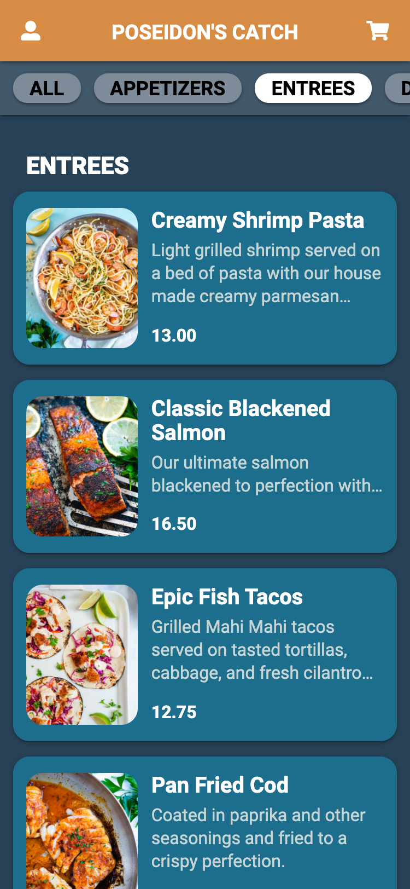
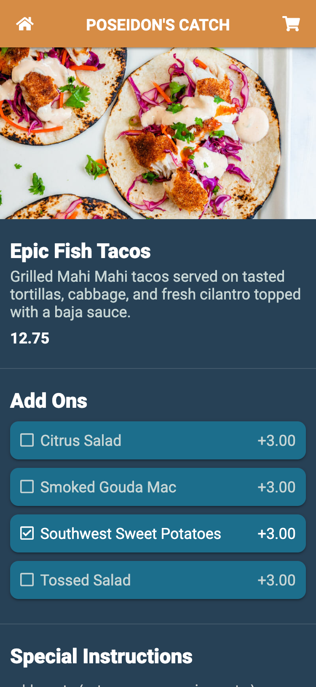

# Feastible

In 2020, food and drink establishments lost _$120 Billion_ in revenue due to the COVID-19 pandemic. With the goal of facilitating safe reopenings, the **Feastible** team has developed a mobile menu solution. The **Feastible** web app offers an ordering platform that alleviates contact and improves customer experience, while providing admin features such as menu customization and order tracking.

**Feastible** is a mobile-first web app built with [React](https://reactjs.org/) frontend, express server, and [MongoDB](https://www.mongodb.com/) hosted on [Atlas](https://www.mongodb.com/cloud/atlas). **Feastible** utilizes [bcrypt](https://www.npmjs.com/package/bcrypt) and [jsonwebtoken](https://www.npmjs.com/package/jsonwebtoken) to hash user passwords and provide a secure login infrastructure. [Cookies](https://developer.mozilla.org/en-US/docs/Mozilla/Add-ons/WebExtensions/Work_with_the_Cookies_API) and [localStorage](https://developer.mozilla.org/en-US/docs/Web/API/Window/localStorage) are leveraged to persist sessions and order data on the client respectively. **Feastible** is currently live on Heroku!

---

## Usage

Visit the deployed **[Feastible](https://restaurunt-menu.herokuapp.com/)** web app!

---

## Installation

1. Head over to the [Feastible repository](https://github.com/bcshanken/restaurantMenu)
2. Press the green 'code' button and select method of download
3. Install and start [MongoDB](https://www.mongodb.com/) on your local machine
4. Open the repo in your text editor of choice
5. Execute `npm install`, `npm run seed`, then `npm start`

---

## Technologies Used

<table>
<td>

- [Atlas](https://www.mongodb.com/cloud/atlas)
- [axios](https://www.npmjs.com/package/axios)
- [bcrypt](https://www.npmjs.com/package/bcrypt)
- [Cookies](https://developer.mozilla.org/en-US/docs/Mozilla/Add-ons/WebExtensions/Work_with_the_Cookies_API)
- [cookie-parser](https://www.npmjs.com/package/cookie-parser)
- [dotenv](https://www.npmjs.com/package/dotenv)
- [express](https://www.npmjs.com/package/express)
- [Figma](https://www.figma.com/)
- [Font Awesome](https://fontawesome.com/)

</td>
<td>

- [Heroku](https://www.heroku.com/)
- [if-env](https://www.npmjs.com/package/if-env)
- [jsonwebtoken](https://www.npmjs.com/package/jsonwebtoken)
- [localStorage](https://developer.mozilla.org/en-US/docs/Web/API/Window/localStorage)
- [Materialize CSS](https://materializecss.com/)
- [MongoDB](https://www.mongodb.com/)
- [mongoose](https://www.npmjs.com/package/mongoose)
- [mongoose-auto-increment](https://www.npmjs.com/package/mongoose-auto-increment)
- [React](https://reactjs.org/)

</td>
</table>

---

## License

Licensed under the [MIT](https://opensource.org/licenses/MIT) license.
